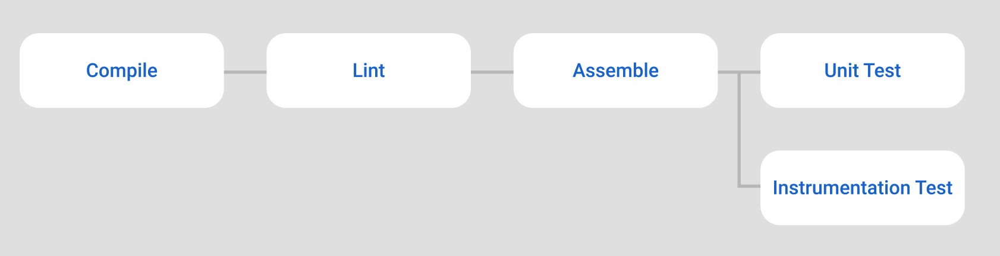

# GitHub Actions



</br>

## Pull Request Workflow

When a pull request is made to master, the pull request workflow is activated and run the following jobs in order. To customize when to run the workflow, configure the following piece of yml.

```
on:
  pull_request:
    branches:
      - master
```

</br>

## Jobs

| Job         | Description   |
| ----------- | ------------- |
| compile     | Install dependencies and compile debug and test sources   |
| lint      | Install dependencies and execute lint debug   |
| assemble | Install dependencies and assemble debug and test APKs   |
| unit_test | Install dependencies and execute unit tests   |
| instrumentation_test | Install dependencies and execute instrumentation tests  |